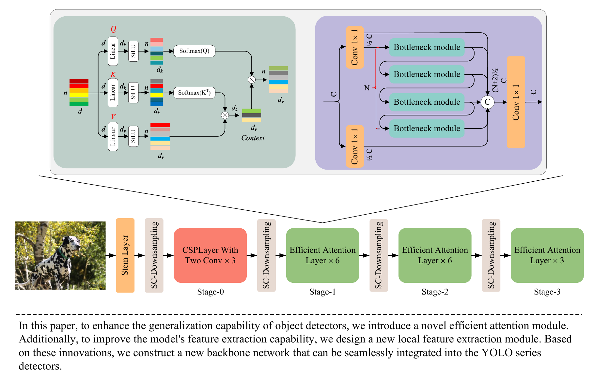

# Improving generalization capability of object detectors via efficient global attention

## Introduction

This repository contains the code for the paper "Improving Generalization Capability of Object Detectors via Efficient Attention".

Real-world applications are highly variable, and object detectors must handle various environmental changes, such as lighting, weather conditions, and viewpoint differences. Therefore, these models need strong generalization capability. According to Gestalt theory, human-level generalization emerges from global perception abilities. In this paper, we aim to enhance the generalization capability of YOLO series detectors by introducing global self-attention mechanisms. Specifically, to address the quadratic complexity issue of the vanilla self-attention module, we propose a new efficient attention module. Additionally, to enhance the model's feature extraction capability, we introduce a new local feature extraction module. Building on these two components, we construct a new backbone network that can be seamlessly integrated into the YOLO series detectors. Thanks to the global perception capability of the efficient global attention module and the strong learning ability of the local feature extraction module, our method achieved a +1.8 AP improvement on YOLOv8 and a +1.0 AP improvement on YOLOv10 in experiments on the COCO dataset, demonstrating the superior generalization capability. Ablation studies on the Pascal VOC dataset further validated the effectiveness and efficiency of each design component. Finally, experiments on the Diverse-Weather dataset confirmed the robust generalization capability of our method, which significantly outperforms state-of-the-art methods.



## Usage

Our detection code is developed on top of [MMYOLO v0.60](https://github.com/open-mmlab/mmyolo). Please prepare the environment according to the [installation](https://mmyolo.readthedocs.io/zh-cn/dev/get_started/installation.html) documentation.

**Note:** MMYOLO v0.60 supports up to PyTorch 1.13 and CUDA 11.7. Ensure that your environment meets these requirements for compatibility.

```bash
conda install pytorch==1.13.1 torchvision==0.14.1 torchaudio==0.13.1 pytorch-cuda=11.7 -c pytorch -c nvidia
```

### Training

- Multi-gpu training

```bash
bash dist_train.sh configs/eattn_net/eattn_net_s_syncbn_fast_8xb16-500e_coco.py 2
```

- Single-gpu Training

```bash
python train.py configs/eattn_net/eattn_net_s_syncbn_fast_8xb16-500e_coco.py
```

### Testing

```bash
python test.py configs/eattn_net/eattn_net_s_syncbn_fast_8xb16-500e_coco.py work_dirs/eattn_net/eattn_net_s_syncbn_fast_8xb16-500e_coco/best_coco_bbox_mAP_epoch_xxx.pth
```

## Citation

If you find this project useful in your research, please consider cite:

```
@article{chen2025improving,
  title={Improving generalization capability of object detectors via efficient global attention},
  author={Chen, Jie and Er, Meng Joo},
  journal={Neurocomputing},
  pages={130287},
  year={2025},
  publisher={Elsevier}
}
```
